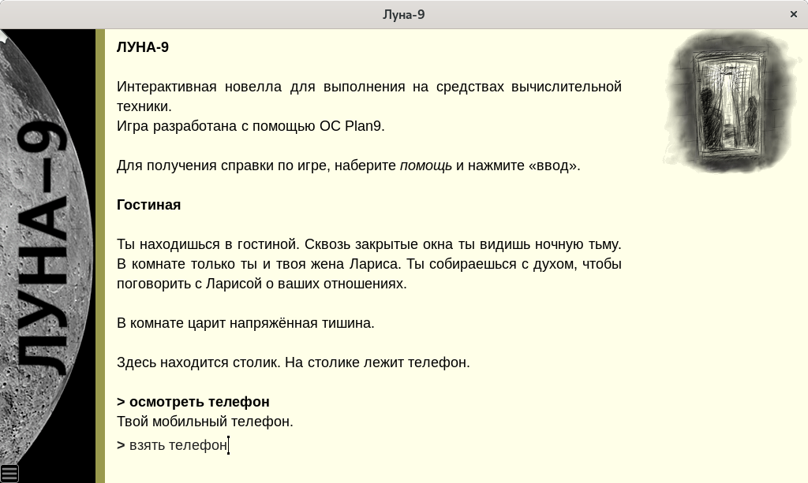
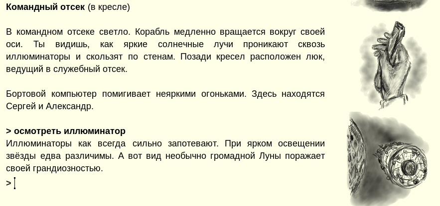
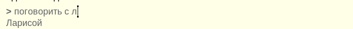

### Игра "Луна-9"

Добро пожаловать! Похоже, что вы готовы погрузиться в игру с текстовым управлением? Что же, должен признаться, я очень рад это слышать. Данное руководство содержит информацию, которая поможет вам, если вы не были знакомы с подобными играми раньше.

### Интерактивная литература

"Луна-9" это игра с текстовым вводом. Подобные игры появились очень давно. Вероятно тогда, когда вас ещё не было на свете. Это классический жанр, известный под названием _интерактивная литература_. И это не та интерактивная литература с абзацами текста и кнопками выбора под ними, которые сегодня заполонили маркеты мобильных платформ! В "Луне-9" вы получаете уникальную смесь интеллигентности книги и интерактивности театра. Когда всё, что есть перед вами, это текст и ожидание _вашего_ ввода.

Подобных игр сегодня делается очень мало, особенно на русском языке. Так что, можно сказать, вас ожидает уникальный опыт!

Не смотря на солидный возраст жанра, данная игра написана с использованием современного движка [МЕТАПАРСЕР3](https://instead3.syscall.ru/page/metaparser/). Движок учитывает особенности русского языка и содержит механизмы, которые позволяют даже игроку без опыта не испытывать затруднений при прохождении. Когда вы пройдёте "Луну-9", вы сможете играть и в другие подобные игры, которые _по настоящему_ похожи на интерактивные книги.

### Взаимодействие с игрой



Когда вы начинаете играть, перед вами выводится описание _сцены_ -- текущей игровой ситуацией в которой вы оказались. Внимательно прочитайте текст сцены и подумайте, что именно вам делать?

Вы вводите команды с клавиатуры и нажимаете клавишу "ввод". Если текст не помещается на экран, вы можете скроллировать его клавиатурой (pgup/pgdown) или мышью (тасканием или колёсиком). Для повтора предыдущих команд вы можете воспользоваться стрелками вверх/вниз. "Backspace" -- удаляет последний введённый символ.

### Команды

Большинство команд задаются в форме: глагол существительное. Знаки препинания и регистр букв не имеет значения. Например:

```
> осмотреть телефон
> взять телефон
> открыть дверь
> надеть шапку
```

Но есть команды без существительного, например:


```
> ждать
> спать
> выйти
> войти
```

Или команды, которые требуют два существительных:


```
> открыть дверь ключом
> отдать ключ гоблину
> вставить кристалл в панель
```

Команды, которые требуют больше чем два существительных, в игре _не используются_.

Игра знает множество глаголов, часть из которых являются синонимами. Например, нет отличий между "ехать на север", "идти на север" или даже "бежать на север". Зная это, старайтесь выбирать привычные глаголы в неопределённой форме, такие как: "взять, бросить, говорить, отдать, ударить, гладить, махать, крутить, дёргать, толкать и так далее. Игре не важно, положите ли вы монету в копилку, вставите её или засунете. За один "ход" игры выполняйте одно простое действие. Формулируйте действие просто!

### Объекты

В большинстве игр с текстовым вводом (и "Луна-9" не исключение) принято, что взаимодействовать можно только с теми объектами, которые упомянуты в тексте. Например, если вы находитесь в комнате, но в описании комнаты не упомянуты: пол, стены, люстра и многие другие объекты, то при попытке взаимодействия с такими объектами игра сообщит вам, что они не описаны. Не удивляйтесь этому факту! Если в комнате не упоминается люстра, значит для сюжета истории она не важна. Работайте только с теми объектами, которые, так или иначе, присутствуют в тексте.



Также, игра работает в данный момент времени только с теми объектами, которые находятся в зоне досягаемости. Если вы катались на луноходе по Луне, а потом зашли внутрь лунной базы, то при попытке выполнить команду: идти к луноходу, вы получите сообщение о том, что луноход не описан. Просто потому, что он не находится на данной сцене.

### Осматривание

Самая часто используемая команда (или глагол) -- осмотреть. Вы можете осматривать сцену целиком или какие-то детали по отдельности. В любом случае, для этого используется глагол "осмотреть".

Например:

```
> осмотреть телефон
> осмотреть Ларису
```

Чтобы осмотреть всю сцену, можно набрать "осмотреть всё" или "осмотреть". Но проще просто нажать "ввод".


Игру стоит начать с команды:

```
> осмотреть себя
```

В играх с текстовым вводом, кроме команды "осмотреть" можно также "смотреть в" и "смотреть под". Но в игре "Луна-9" эти возможности _не используются_.

На некоторые предметы можно садиться, ложиться, залазить в них, класть в них (или на них) другие предметы. Например, на столик можно положить конверт. Такие предметы стоит осматривать особенно пристально, так как их содержимое не всегда показывается в тексте описания сцены. Особенно, если это закрытый шкаф. Осматривая подобные предметы, вы можете узнать о других предметах.

Иногда, вам будут встречаться сцены с текстом, для чтения которого нужно постоянно вводить "дальше". Вы увидите это по подсказке внизу текста. В таком случае, для продолжения чтения вы можете просто нажимать "ввод".

### Инвентарь

Некоторые предметы вы можете брать с собой. Чтобы узнать, какие предметы сейчас с вами, используйте команду "инвентарь".

```
> взять телефон
> инвентарь
```


### Одежда

Одежду можно надевать и снимать.

### Перемещения

Традиционно, в играх с текстовым вводом для идентификации направлений применяется компас. Если вы видите, что в тексте сцены присутствует сторона света, то скорее всего вы можете пойти в эту сторону. Все перечисленные команды сработают одинаково:

```
> идти на север
> север
> с
```

Кроме направлений компаса (восток, юг, запад, восток) и промежуточных направлений (св,юв,юз,сз), существует возможность ходить вверх (вв) и вниз (вн). Иногда можно заходить внутрь и выходить наружу.

Кроме того, в игре "Луна-9" вы можете перемещаться по названию ориентира. Например:

```
идти в кабину
идти в люк
```

Или сокращённо:

```
в кабину
в люк
```

### Облегчение процедуры ввода

Для упрощения ввода вы можете воспользоваться клавишей "tab". Например, наберите "осм" и нажмите "tab". При этом, глагол сам дополнится до "осмотреть". Также можно дополнять и предметы. Если вы хотите просто осмотреть предмет, вы можете просто написать название предмета:

```
осмотреть телефон
телефон
```

Кроме этого, вы можете сокращать существительные.

```
осмотреть тел
```

Однако, если в сцене кроме телефона присутствует телевизор, может возникнуть неоднозначность. Игра всегда сообщает в таких ситуациях, что за предмет был выбран.

Некоторые глаголы тоже можно сокращать:

- о, осм - осмотреть;
- вкл - включить;
- выкл - выключить;
- ж - ждать;
- и, инв - инвентарь.

Также, играя на компьютере, вы можете нажать клавишу F1 и включить интерактивные подсказки при вводе.




### Сохранение игры

Нажмите ESC для выхода в меню. Кроме того, вы можете использовать:

- F2 - сохранить;
- F3 - загрузить;
- F8 - быстрое сохранени;
- F9 - быстрая загрузка.

### Заключение

Поздравляю, теперь вы готовы к погружению! Спасибо за чтение этого небольшого руководства. Время не было
потречено зря, вы скоро убедитесь в этом.

Желаю приятной игры!

### Контакты

Если вам понравилась игра и вас интересуют другие похожие игры, или вам захотелось написать отзыв автору игры:

- [Игры на INSTEAD](https://instead-games.ru)
- [Игры Петра Косых](https://instead.itch.io)
- [Интерпретатор INSTEAD](https://instead.syscall.ru)
- [Станция PING](https://hugeping.tk)

### Список глаголов

Ниже, в качестве примера, приводится список глаголов, который достаточен для прохождения игры "Луна-9".

> будить, вверх, вернуться, взять, включить, вниз, внутрь, войти, вставить, встать, выйти, выключить,
> вылезти, вытащить, гладить, говорить, дальше, дать, двигать, дёрнуть, ехать, ждать, закрутить, закрыть,
> залезть, идти, инв, лезть, лечь, надеть, нажать, наружу, обнять, осмотреть, ответить, открыть, повернуть,
> положить, поцеловать, пристегнуть, проснуться, разбить, разобрать, расстегнуть, сдвинуть, сесть, слезть,
> сломать, слушать, смотреть, снять, сорвать, съесть, толкнуть, тянуть, ударить.

### Подсказки

Смотрите файл hints.txt в каталоге с игрой.
